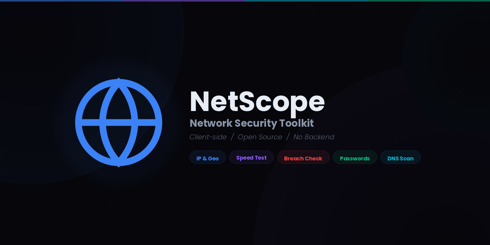

<p align="center">
  <a href="https://patrickking67.github.io/netscope/">
    
  </a>
</p>

<p align="center">
  <strong>A client-side network security toolkit.</strong><br>
  IP lookup, speed testing, breach detection, password generation, and DNS analysis, all in your browser.
</p>

<p align="center">
  <a href="https://patrickking67.github.io/netscope/"></a>
  <a href="https://github.com/patrickking67/netscope"></a>
  <a href="LICENSE"></a>
</p>

<p align="center">
  
  
  
  
  
  
  
  
  
</p>

---

## Table of Contents

- [About](#about)
- [Features](#features)
- [Tech Stack](#tech-stack)
- [Getting Started](#getting-started)
- [Deployment](#deployment)
- [Privacy](#privacy)
- [Inspiration](#inspiration)
- [License](#license)

---

## About

NetScope is a lightweight, open-source network security toolkit that runs entirely in your browser. No backend servers, build tools, or frameworks. Just plain HTML, CSS, and JavaScript.

It gives you instant insight into your network footprint: where your traffic originates, how fast your connection is, whether your credentials have been compromised, and how well a domain's DNS and email security are configured.

Sign in with Google, GitHub, or email to save results across devices via Firebase. Or skip sign-in entirely. Every feature works without an account.

<p align="center">
  <a href="https://patrickking67.github.io/netscope/">
    
  </a>
</p>

## Features

| Feature | Description |
| --- | --- |
| **IP & Geolocation** | Detect your public IP, ISP, ASN, proxy/VPN status, and map your approximate location |
| **Speed Test** | Multi-connection download, upload, ping, and jitter with animated gauges via Cloudflare |
| **Breach Check** | Check emails (XposedOrNot) and passwords (HIBP k-anonymity) against known breaches |
| **Password Generator** | One-click presets (Password, PIN, Passphrase, Hex Key) plus custom length, character sets, and strength meter |
| **DNS & Security Scan** | Lookup DNS records, check SPF/DMARC/DKIM, DNSSEC, and WebRTC leak detection |
| **Full Scan** | Run every security test in sequence with a step-by-step progress overlay |
| **Export** | Copy results, share via email, or download a PDF report |
| **Dark / Light Theme** | Toggle between themes with persistent preference |
| **Authentication** | Sign in with Google, GitHub, or email/password via Firebase |
| **Cloud Save** | Save and retrieve test results across devices (requires sign-in) |

## Tech Stack

Pure HTML, CSS, and JavaScript. The repo root **is** the deployable output, with no bundler, transpiler, or `node_modules`.

### APIs & Services

| Feature | Provider | How It's Used |
|---------|----------|---------------|
| IP Detection | [ipify](https://www.ipify.org/) | Fetches public IP address |
| Geolocation | [ipapi.co](https://ipapi.co/) / [ipwho.is](https://ipwho.is/) | Resolves IP to location, ISP, ASN |
| Password Breach | [HIBP Pwned Passwords](https://haveibeenpwned.com/API/v3#PwnedPasswords) | k-anonymity hash prefix lookup |
| Email Breach | [XposedOrNot](https://xposedornot.com/) | Checks email against breach databases |
| DNS Lookup | [Google DNS-over-HTTPS](https://dns.google/) | Resolves DNS records over HTTPS |
| Maps | [Leaflet](https://leafletjs.com/) + [OpenStreetMap](https://www.openstreetmap.org/) | Interactive geolocation map |
| Speed Test | [Cloudflare](https://speed.cloudflare.com/) | Multi-connection download/upload, ping, and jitter |
| Auth & Database | [Firebase](https://firebase.google.com/) | Google, GitHub, & email auth + Firestore |
| PDF Export | [jsPDF](https://github.com/parallax/jsPDF) | Client-side PDF generation |

### Frontend Libraries

| Library | Version | Purpose |
|---------|---------|---------|
| [Leaflet](https://leafletjs.com/) | 1.9.4 | Map rendering |
| [jsPDF](https://github.com/parallax/jsPDF) | 2.5.1 | PDF export |
| [Firebase SDK](https://firebase.google.com/) | 10.12.0 | Auth + Firestore (compat) |
| [Inter](https://rsms.me/inter/) | Variable | UI typeface |
| [JetBrains Mono](https://www.jetbrains.com/lp/mono/) | Variable | Monospace typeface |

## Getting Started

No dependencies to install. Clone and serve.

```bash
# Clone the repo
git clone https://github.com/patrickking67/netscope.git
cd netscope

# Serve locally (pick one)
npx serve .
# or
python3 -m http.server 3000
# or just open index.html in your browser
```

### Firebase Setup (Optional)

Firebase powers authentication (Google, GitHub, email/password) and cloud save. The app works fully without it. These features simply do not appear.

To configure Firebase for your own fork:

1. Create a project at [console.firebase.google.com](https://console.firebase.google.com/)
2. Enable **Authentication** with your desired providers (Google, GitHub, Email/Password)
3. Enable **Cloud Firestore**
4. Copy your config into `assets/js/firebase-config.js`

See the full walkthrough in **[docs/FIREBASE_SETUP.md](docs/FIREBASE_SETUP.md)**.

## Deployment

NetScope deploys automatically to **GitHub Pages** via the included GitHub Actions workflow.

```
Push to main  →  .github/workflows/static.yml  →  Live on GitHub Pages
```

**To deploy your own fork:**

1. Fork this repository
2. Go to **Settings > Pages** and set source to **GitHub Actions**
3. Push to `main`. The site updates within minutes.

## Privacy

- **Passwords never leave your browser.** They're SHA-1 hashed locally; only the first 5 hash characters are sent to HIBP (k-anonymity).
- **All processing is client-side.** No server receives your raw data.
- **No analytics or tracking.** Zero telemetry.
- **Sign-in is optional.** Every feature works without an account.
- **Cloud saves are private.** If signed in, results are stored in your own Firestore collection.

## Inspiration

NetScope was inspired by several outstanding tools and services:

- **[Ookla Speedtest](https://www.speedtest.net)**: inspired the multi-connection speed test with animated gauges and jitter measurement.
- **[Have I Been Pwned](https://haveibeenpwned.com)**: NetScope uses HIBP's k-anonymity API for privacy-preserving password breach checks.

## License

This project is licensed under the [MIT License](LICENSE).

Copyright (c) 2026 Patrick King

---

<p align="center">
  <a href="https://patrickking67.github.io/netscope/">
    
  </a>
</p>
